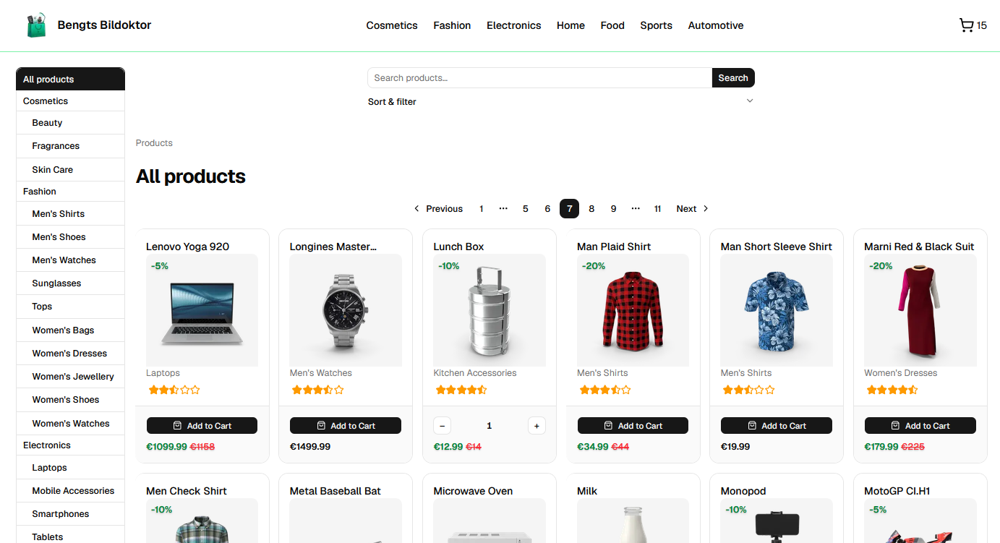
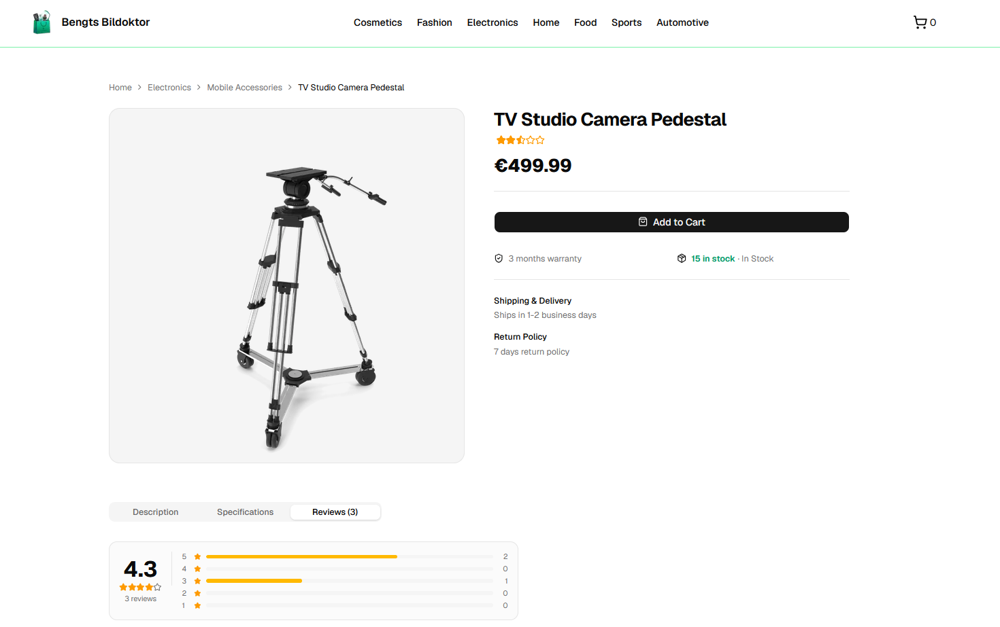
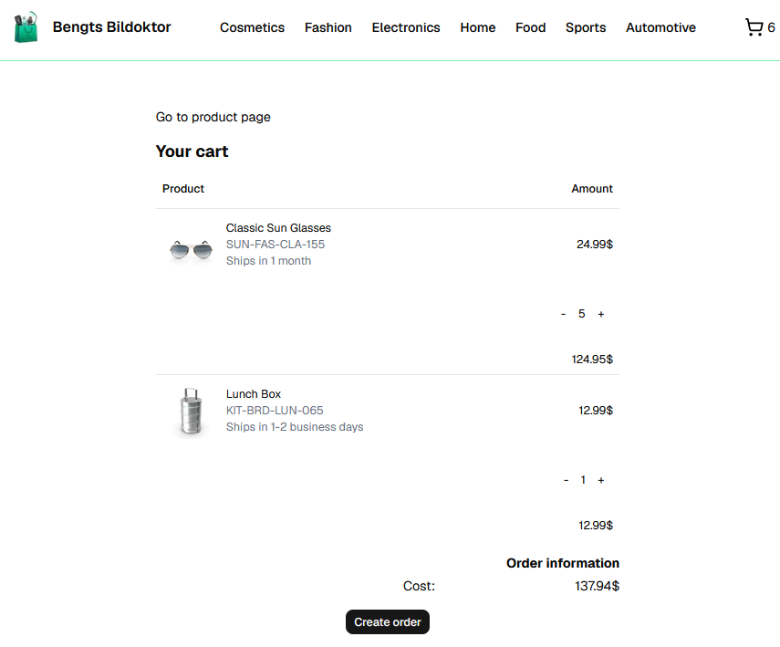
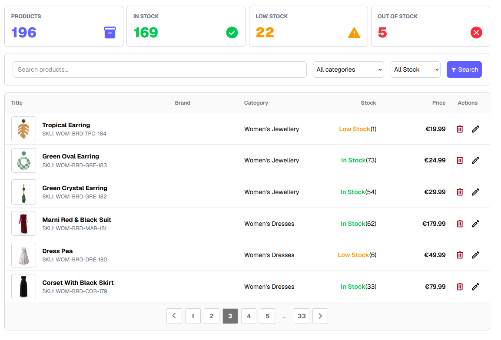

# Webshop

An online storefront featuring full UX, responsive styling, a 10/10 AIM score, etc/todo<!--todo: other good shit-->

Developed as part of Lexicons frontend program by a 3-man team over the course of 3 weeks. 

<!-- todo: Screenshot or GIF of the catalog goes here -->

## Key features

- **Paginated product catalog** driven entirely by URL, thus bookmarkable queries
- **Powerful search** across a wide range of metadata
- **Two level category navigation** with an elegant mobile view
- **Full UX chain** from the initial visit all the way to checkout through product and cart pages
- **Clientside cart functionality** built with cookies, as such persisting across sessions
- **Admin interface** for manually editing source data
- **Loading and error states**, and a layout that works from phone to desktop
- **Accessibility-minded UI**, evaluated by [WAVE](https://wave.webaim.org/)
- **Database connectivity** for using external inventories

## Tech stack

| Technology | What it does | Why we chose it |
| --- | --- | --- |
| [Next.js](https://nextjs.org) (App Router) | User interface and server-rendered pages | Fast page loads, and URL-based navigation makes catalog views shareable. |
| TypeScript | Type safety | Catches mistakes early, which matters when three people share a codebase. |
| [Tailwind CSS](https://tailwindcss.com/) | Styling | Quick, consistent styling without a pile of custom CSS. |
| [shadcn/ui](https://ui.shadcn.com) | UI components (buttons, pagination, sheets, accordions) | Accessible building blocks; the project brief asked for default shadcn styling. |
| [json-server](https://github.com/typicode/json-server/tree/v0.17.4) 0.17.4 | Mock REST API | Lets the frontend be built against a realistic backend without writing one. This functionality was later migrated to Supabase. |
| [Supabase](https://supabase.com/) | Data storage solution | Provides a managed PostgreSQL database, drastically speeding up development without vendor lock-in. |
| GitHub Projects | Sprint board | Planning and tracking work in an Agile workflow. |

Product data seeded from [dummyjson.com](https://dummyjson.com/docs/products), with minor changes.

## Demo / screenshots

<!--todo: possibly broken layout - check on github proper-->
### Catalog 

Click to hide demo images

Click to hide demo images

Click to hide demo images

Click to hide demo images

## Documentation

- `/docs` Additional project documentation (PRD, ADRs, Team Contract, Checklists)
- [Supabase Documentation](https://supabase.com/docs): Database queries, schema, and API reference
- [Next.js Documentation](https://nextjs.org/docs): App Router, Server Actions, and Caching
- [shadcn/ui Documentation](https://ui.shadcn.com/docs): UI component specifications
- [Next.js docs](https://nextjs.org/docs) and [shadcn/ui docs](https://ui.shadcn.com/docs) for the underlying tools

## Database Reference & Supabase Operations

All operations run directly against the PostgreSQL tables hosted in Supabase via `@supabase/supabase-js`.
| Operation | Table | Supabase Method / Call | Description |
| :--- | :--- | :--- | :--- |
| **List products** | `products` | `supabase.from("products").select("*", { count: "exact" }).range(from, to)` | Paginated, filtered, and sorted products catalog |
| **Get product by title** | `products` | `supabase.from("products").select("*").ilike("title", title).limit(1).maybeSingle()` | Product detail page view (`/product/[title]`) |
| **Get product by ID** | `products` | `supabase.from("products").select("*").eq("id", id).single()` | Admin edit prefill view (`/edit-product/[id]`) |
| **Stock statistics** | `products` | `supabase.from("products").select("stock")` | Computes live counts: in stock, low stock (< 10), and out of stock |
| **Create product** | `products` | `supabase.from("products").insert(productData)` | Registers a new product via Server Action |
| **Update product** | `products` | `supabase.from("products").update(productData).eq("id", id)` | Updates existing product details |
| **Delete product** | `products` | `supabase.from("products").delete().eq("id", id)` | Deletes a product by ID via Server Action |
| **List categories** | `categories` | `supabase.from("categories").select("*").order("name")` | Fetches categories (cached for 1h via `unstable_cache`) |

### Pagination, Sorting & Filtering (Supabase Query Builder)
Filtering and pagination logic is handled server-side in `app/page.tsx`:

## Status / roadmap

The project is feature-complete for its original scope:

- [x] Product list with pagination
- [x] Search, category navigation, sorting, and filtering
- [x] Product detail pages
- [x] Persistent shopping cart 
- [x] Add and edit product functionality
- [x] Error handling and loading states
- [x] Responsive layout

Possible future work: `Adding authentication using supabase, create and save orders in database, etc.`

## Acknowledgements

### Main storefront team
- Georgij Li ([@geoli96](https://github.com/geoli96))
- Dmitry
- Tomas Savela ([@f0jzd](https://github.com/f0jzd))

### Admin page team (group 4)

https://github.com/Martin-Joensson/projekt-agila-metoder-webshop

- Gabriel Gaglianone ([@Amuga](https://github.com/Amuga))
- Martin Jönsson ([@Martin-Joensson](https://github.com/Martin-Joensson))
- Tomas Savela ([@f0jzd](https://github.com/f0jzd))
- Josefin Wall ([@josiefinis](https://github.com/josiefinis))

who created the project structure and built the admin page.
<!--todo: link to the older repo for the admin page and acknowledge whoever made that one for good measure-->

**Built with:** [Next.js](https://nextjs.org), [Tailwind CSS](https://tailwindcss.com), [shadcn/ui](https://ui.shadcn.com), [json-server](https://github.com/typicode/json-server). Product data adapted from [DummyJSON](https://dummyjson.com).

Created as part of the frontend program at Lexicon.

<!-- possible chapters -->
## AI-policy
vilka modeller, program... Antigravity, gemini, claude
Alla AI-skrivna kodsnuttar granskades, och AIn ansvarade inte för arkitektur, enbart lokala lösningar.

## Mer om projektledning
Någonting om scrum, 3st sprints på 1 arbetsvecka var, roterande scrum masters, ~~ingen PO~~
/docs för mer info

## 